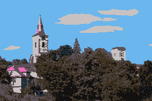
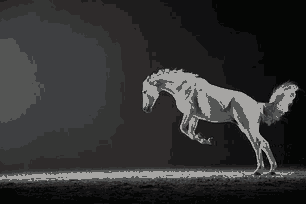

# Pixelize

### Description

Converts input images (jpg/png/bmp...) to "pixel-art" images (kinda...).  
I use it for my games. 

### Features

- support for custom palette
- variable number of colors in palette
- generating a palette from image
- scaling (near interpolation)
- uniform scaling (both axes)
- dump of palette

#### Example transformations 
source image  
  
16 colors with generated palette  
  
8 colors with generated palette, downscaled to 50 %  
  
source image  
  
16 colors with generated palette  
  
8 colors with generated palette, downscaled to 50 %  
  

### Usage 
`pixelize --input <INPUT_FILE> --output <OUTPUT_FILE>` or  
`pixelize -i <INPUT_FILE> -o <OUTPUT_FILE>` or  
`pixelize <INPUT_FILE> <OUTPUT_FILE>`

For more information, try `--help`.  

### Configuration

is in *config.toml* file next to the executable.

- **number_of_colors**  
only used when `use_custom_palette=false`, is used for palette generation  
- **sample_factor**  
  only used when `use_custom_palette=false`, is used for palette generation   
  valid values: from 1 - best quality but slowest, to 30 - worst quality but fastest. 10 is a good compromise.  
- **desired_width**  
  used for scaling. Can be omitted if `uniform_scale_by_height=true`  
- **desired_height**  
-   used for scaling. Can be omitted if `uniform_scale_by_width=true`  
- **uniform_scale_by_width**  
  if set to *true* desired_height will be ignored. It will be calculated from desired_width to preserve the aspect ratio    
- **uniform_scale_by_height**  
  if set to *true* desired_width will be ignored. It will be calculated from desired_height to preserve the aspect ratio  
- **use_custom_palette**  
  if set to *true* the palette will not be generated, instead it will be loaded from custom_palette  
- **custom_palette**  
an array of RGB colors, could be defined like this:  
  `custom_palette = [[255, 0, 0], [0, 255, 0], [0, 0, 255], [0, 0, 0]]`  
this defines 4 color palette with red, green, blue and black colors.  
- **dump-palette**  
will dump the palette into palette.png  